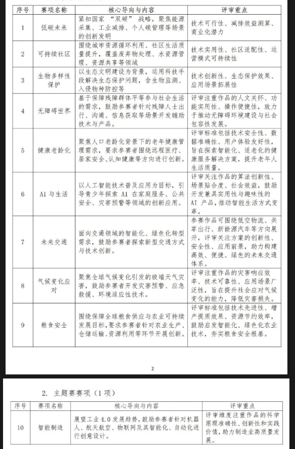

### 25-26全球发明大会

## 一.报名

网站：https://icc.cffpd.org.cn

官方微信：“全球发明大会 中国 竞赛活动”

## 二.参赛流程

### 报名

时间：26.4.4 8:00-6.15 24:00

注册：

作品提交： 

### 省赛

时间：26年6-7月（初审后可参加线下），产出一二三等奖

百分之20无奖

### 总决赛

时间：26.8暂定

## 三.参赛要求

p组：三至五、六年级（小学）

个人/团体(1-4人)

## 四.类别

## 五.参赛材料

发明原型、发明日志、查新报告、发明展板和路演视频

