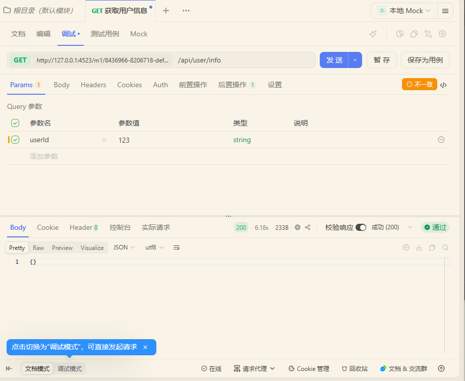

## Apifox

### 基础理解

集 API 设计、API 开发、API 调试、API 管理、 API 文档、API Mock 和自动化测试等功能于一体

**GET**：从服务器"拿"数据

**POST**：向服务器"提交"数据

**URL**：接口的"地址"

**Query参数**：跟在 `?` 后面的参数，比如 ?page=1&size=10

**Path参数**：写在URL路径里的参数，比如 `/users/{id}` 里的 {id}

**状态码200**：请求成功

**状态码404**：地址不存在

### 练习

##  你的第一个"成功"练习步骤

**就现在，跟着做：**

1. 打开你的Apifox
2. 点击左侧 **+ 新建接口**
3. 方法选 `GET`
4. URL填写：`https://jsonplaceholder.typicode.com/posts/1`
5. 直接点击 **发送**

✅ **预期结果**：状态码200，下面会显示一篇博客文章的JSON数据。

你会看到这样的返回（这就是一次成功的API测试）：

{
  "userId": 1,
  "id": 1,
  "title": "文章标题",
  "body": "文章正文"
}

### 继续

#### 第1步：新建项目

打开 Apifox 后，在左侧找到你的团队（比如"我的团队"），点击旁边的 **「+ 新建项目」**。（项目就是一个"文件夹"，用来装你所有的接）

#### 第2步：新建第一个接口

#### 第3步：试试带参数的接口

新建另一个接口：

1. 同样新建接口，方法选 GET
2. URL 填：`https://jsonplaceholder.typicode.com/posts`
3. 在 **Params** 标签下添加一个 Query参数：
   - 参数名：`userId`
   - 参数值：`1`
4. 点击发送

✅ 你会看到只返回了 userId=1 的文章列表——这就是Query参数的作用：**筛选数据**。

### 操作一遍最小闭环：

**定义接口 → 选择环境(真实/Mock) → 发送请求 → 查看响应 → 分享文档**

#### 定义文档：

创建接口GET ，**接口路径**：填 /api/user/info，**接口名称**：填 `获取用户信息`，保存。

#### 发送第一个真实请求

在 **“请求参数”** -> **“Query”** 区域，添加一个参数：

- **参数名**：`userId`
- **值**：随便填个数字，比如 `123`
- 发送

结果：404、红色报错，很正常，因为你的后端服务还没写。

#### 开启Mock，体验“无后端开发”

选择 **“本地 Mock”**。

**观察结果**：

- 这次会**立刻返回一个绿色的成功响应**，并且数据看起来像一个真实的用户对象（比如`{"name": "张三", "age": 25, ...}`）。
- 这些数据是Apifox根据你的接口定义自动生成的。**前端开发者拿到这个URL，就可以直接写代码调用，完全不用等后端。**

> **小提示**：如果你找不到“本地 Mock”环境，可以这样手动创建：
>
> 1. 点击Apifox右上角的 **“管理环境”** （一个类似地球或服务器的小图标）。
> 2. 点击 **“新建环境”** ，名称填`本地Mock`。
> 3. 在这个环境的 **“前置URL”** 里，填入 `http://mock.apifox.com` （或任何内容，因为Apifox会自动拦截）。
> 4. 保存后，在右上角切换到“本地Mock”环境即可。

#### 第四步：看一眼“文档”，它会自动生成

做完上面三步，回到 **“文档”** 标签页（“运行”标签页的左边）。

你会发现，你刚才填写的`GET`方法、`/api/user/info`路径、`userId`参数，都已经自动生成为一份**格式规范、可直接分享的在线文档**。

- **前端同事**：可以通过你分享的链接，直接看到所有接口的定义和Mock地址。
- **测试同事**：可以在这里直接点击“发送”按钮进行测试。

### 从接口调试到自动化测试

#### 第一步：接口调试 + 加断言

 添加断言（验证返回结果）：**"后置操作"** → 点击 **"添加后置操作"** → 选择 **"断言"**

| 断言对象 | `Response JSON` | 校验返回的JSON数据 |
| :------: | --------------- | ------------------ |
| JSONPath | `$.code`        | 定位到code字段     |
| 比较方式 | `等于`          | 判断是否相等       |
|  预期值  | `0`             | 期望的业务状态码   |

**常用JSONPath示例**：

- `$` → 整个响应体
- `$.code` → 根节点下的code字段
- `$.data.name` → data对象下的name字段
- `$.data.list[0]` → 数组的第一个元素

保存为用例（**注意**：如果不保存为用例，自动化测试里无法引用这个断言配置）

#### 第二步：配置Mock数据（后端没写时用）

接口定义中

找到 **"返回响应"** → **"响应示例"** → **"添加示例"**填入示例JSON

在测试用例中配置Mock期望，期望条件留空（代表所有请求都返回此数据），在 **"返回数据"** 框中粘贴你的JSON

JSON

{
  "code": 0,
  "message": "success",
  "data": {
    "name": "张三",
    "age": 25
  }
}

#### 第三步：自动化测试（多接口串联）

**"自动化测试"**--**"新建测试场景"**--输入场景名称，如"用户登录-获取信息流程"

 **"添加步骤"**-- **"从接口用例导入"**

运行测试

查看测试详情
