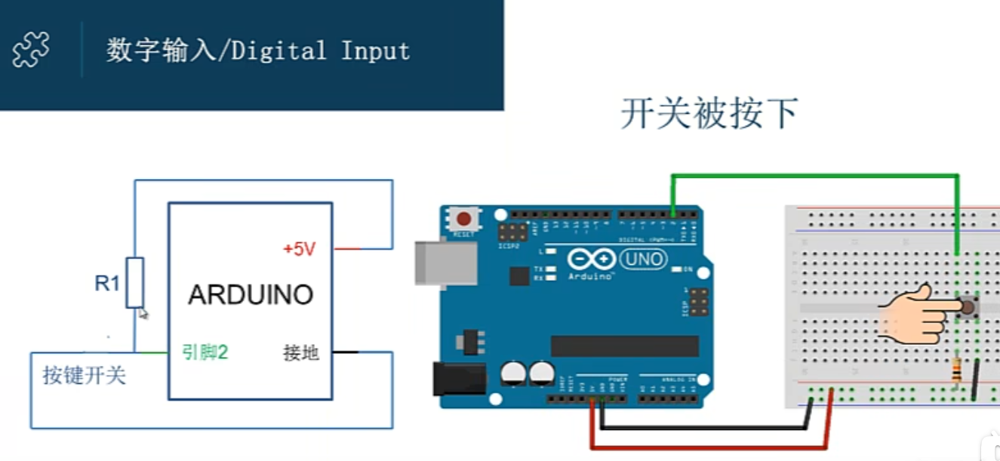
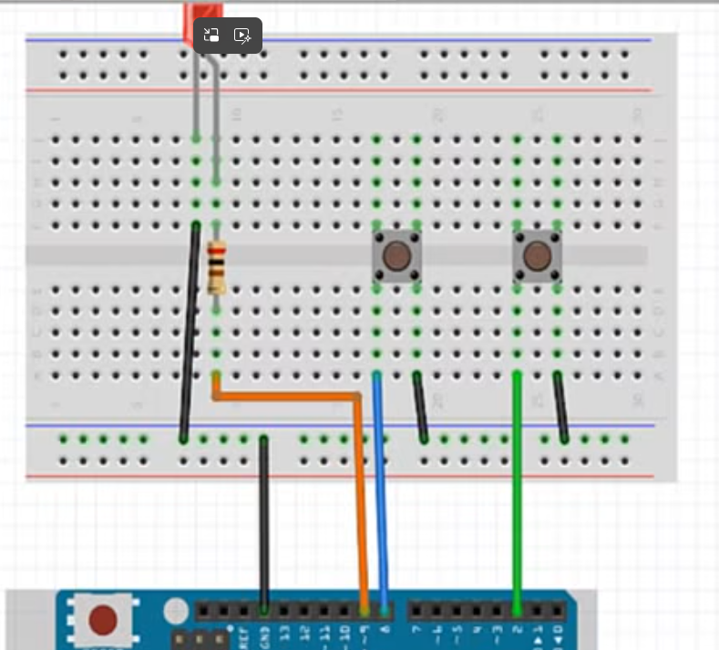
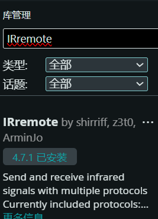
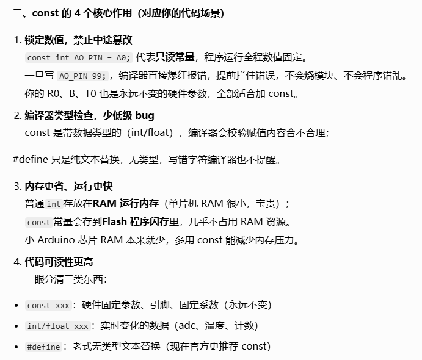
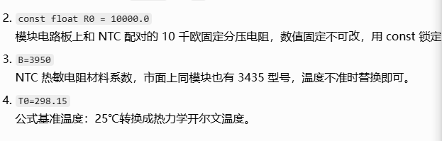
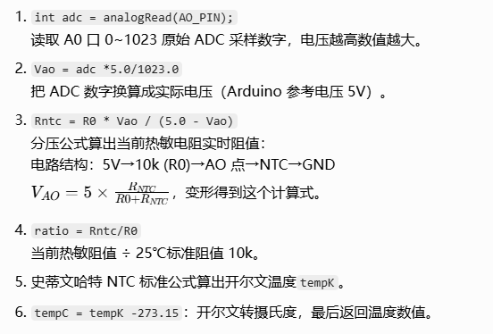

# NANO

## 一.初识

模拟输入：A0-A7

数字引脚：D2-D13

### 结构

Setup()函数：初始化

Loop()函数：主函数

pinMode（pin,mode）————pin表示0-13，mode表示OUTPUT输出和INPUT输入

digitalWrite(pin,value)————value表示HIGH高电平和LOW低电平

digitalRead(pin)————数字IO读取

delay(ms)————延迟函数（单位ms）（毫秒）

delayMicroseconds(us)————（微秒）

### 点亮led灯

text01

```c++
void setup() {
    pinMode(2, OUTPUT);
}
void loop() {
    digitalWrite(2, HIGH);
    delay(1000);
    digitalWrite(2, LOW);   
    delay(1000);
}
```

### Arduino程序函数(Functions)

eg.digitalWrite(LED_BUILTIN,HIGH)，这个就是函数，参数为LED_BUILTIN和HIGH。

分有参，无参。

官网---Learning----Reference或太极创客也可以

### Arduino循环

- **while循环**

while循环将会连续、无限循环，直到括号()内的表达式变为false。必须用一些东西改变被测试的变量，否则while循环永远不会退出。

- **do...while循环**

**do ... while**循环类似于while循环。在while循环中，循环连续条件在循环开始时测试，然后再执行循环体。do ... while语句在执行循环体之后测试循环连续条件。因此，循环体将被执行至少一次。

-  **for循环**

**for循环**执行语句预定的次数。循环的控制表达式在for循环括号内完全的初始化，测试和操作。

-  **嵌套循环**

C语言允许你在另一个循环内使用一个循环。

- **无限循环**

它是没有终止条件的循环，因此循环变为无限。

```c++
for (;;) {
   // statement block
}
```

```c++
while(1) {
   // statement block
}
```

```c++
do {  
   Block of statements;
   }  
   while(1);
```

### 七彩LED灯闪烁

注意：模块上有两个GND，你只需要连接其中一个

实验原理：电源打时，7彩LED将闪烁内置颜色

### 关键字

**if（关系表达式)**

**{关系运算结果为真，运行此段程序}**

**else{关系运算结果为假，运行此段程序}**     

如果（条件）执行...否则执行...

### 数据类型

**boolean**    布尔类型

### 轻触开关按键实验

text02

````c++
int p2 = 2;

int p3 = 3; 

void setup() {

  pinMode(2, OUTPUT);//数字2管脚输出，led

  pinMode(3,INPUT);//数字3管脚，按钮输入

  }

void loop() {

  boolean value = digitalRead(p3);

  if(value == HIGH){

  digitalWrite(p2, LOW);

  }

  else{

  digitalWrite(2, HIGH);  

  }  

}
````

### 按键

按下----0

不按----1

此为上拉电阻。（电阻一端接5v）

同侧不相通原则。





### 逻辑控制（按键）

DigitallnputPullup

INPUT_PULLUP是什么？

赋值运算 =

关系运算 ==

if...else...是什么？判断结果两种----truefalse（1和0）

第二种写法：

text09

### 振动开关传感器实验

实验原理：一旦摇动，led灯就亮（动为high,不动为low）

text03

```c++
int p2 = 2;

int p3 = 3;

int p10 = 10; 

void setup() {

  pinMode(2, OUTPUT);//数字2管脚输出，led

  pinMode(3,OUTPUT);

  pinMode(10,INPUT);//数字10管脚，振动模块输入

  }

void loop() {

  boolean value = digitalRead(p10);

  if(value == HIGH){

  digitalWrite(p2, HIGH);

  digitalWrite(p3, HIGH);

  }

  else{

  digitalWrite(p2, LOW);  

  digitalWrite(p3, LOW);

  }  

}
```

### 触摸开关传感器实验

实验原理：触摸点亮小灯

摸：HIGH；不摸：LOW

代码自己写写，跟上面类似

### 模拟输出-analogWrite

两个按键一个控制led灯慢慢亮起，一个控制慢慢熄灭。


3,5,6,9,10,11(PWM)

亮度0-255

复合运算符


text10

### 红外遥控实验

红外接收头只要接受38KHz的频率红外线，对其他频率段的红外信号不敏感。这样遥控器就可以发出载波在38KHz的频率，就能接受信号，从而构成通讯。

任务：通过遥控器控制某个键（如电源键），按键时让双色灯发红，不按为蓝。

IRremote库[IRremote库 – 太极创客](http://www.taichi-maker.com/homepage/reference-index/arduino-library-index/irremote-library/)

常用红外协议资料

NEC协议：地址信息+指令信息

1838红外接收器


安装IRremote库：项目--导入库--管理库

decode函数：用于判断红外接收器所接收到的红外信号是否可以被解析。if成功，返回非零值，将解析结果存储于results;if不成功，返回0。

text04

```c++
// 1. 包含新版红外库的头文件
#include <IRremote.hpp>

// 2. 定义引脚名字（方便改，一看就懂）

const int irReceiverPin = 7;  // 红外接收器信号脚接 D7

const int ledPin = 13;     // 板载LED脚 D13

// 3.  setup：只运行一次（初始化）

void setup() {

 pinMode(ledPin, OUTPUT);   // 把LED脚设置为输出模式

 Serial.begin(9600);      // 开启串口，波特率9600（看打印信息）

 IrReceiver.begin(irReceiverPin); // 启动红外接收功能

}

// 4. loop：不断重复运行

void loop() {

 // 如果**接收到了红外信号**

 if (IrReceiver.decode()) {

  // 把收到的红外码打印到串口监视器（方便你看）

  Serial.print("收到红外码: 0x");  
         
  Serial.println(IrReceiver.decodedIRData.decodedRawData, HEX);

  // 判断：是不是我们要的那个按键码

  if (IrReceiver.decodedIRData.decodedRawData == 0xBA45FF00) {

   digitalWrite(ledPin, HIGH);  // 是 → 点亮LED

  } else {

   digitalWrite(ledPin, LOW);  // 不是 → 熄灭LED

  }

  IrReceiver.resume(); // 准备接收下一个信号

 }

}
```

### 舵机实验

棕色--gnd

红色--5v

橙色--信号线

舵机是一种只能旋转180度的减速电机，它通过板子发送PWM脉冲来控制。

导入库Servo  1.3.0 

servo.attach(9)：告知Arduino舵机的数据线连接在哪一个引脚上9

servo.write(0)：说明 控制舵机旋转。对于标准舵机，write()函数会将舵机轴旋转到相应的角度位置。

text05

```c++
#include <Servo.h>

Servo myservo;//创建Servo对象用以控制伺服电机。
//很多开发板允许同时创建12个Servo对象
void setup() {

 myservo.attach(9);

 myservo.write(0);

 delay(1000); 

}

void loop() {

 myservo.write(15);

 delay(1000); 

 myservo.write(30);

 delay(1000); 

 myservo.write(45);

 delay(1000); 

 myservo.write(60);

 delay(1000); 

 myservo.write(75);

 delay(1000); 

 myservo.write(90);

 delay(1000); 

 myservo.write(75);

 delay(1000); 

 myservo.write(60);

 delay(1000); 

 myservo.write(45);

 delay(1000); 

 myservo.write(30);

 delay(1000); 

 myservo.write(15);

 delay(1000); 

 myservo.write(0);

 delay(1000); 

}
```

text06

```c++
#include <Servo.h>

Servo myservo; 

int pos = 0; 

void setup() {

 myservo.attach(9); 

}

void loop() {

  for (pos = 0; pos <= 180; pos += 1) { 

  myservo.write(pos);        

  delay(15);            

 }

 for (pos = 180; pos >= 0; pos -= 1) { 

  myservo.write(pos);       

  delay(15);            

 }
}
}
```

### 干簧管传感器实验

一种用于检测磁场的传感器，能感应磁铁的存在。

text07

正常情况下为high，吸磁后为low

### 模拟温度传感器

左边黑色圆珠元件是**NTC 热敏电阻**，温度越高，电阻越小；板载 LM393 电压比较器，同时输出模拟 AO、数字 DO 信号，蓝色可调电位器用来调整温度触发阈值

 引脚（右侧 4 针，从上到下）

1. **VCC**：供电，3.3V~5V（Arduino 推荐 5V）
2. **GND**：电源负极
3. **AO**：模拟输出，电压随温度连续变化（测实时温度）
4. **DO**：数字输出，达到设定温度输出低电平，低于阈值高电平（温度开关）

AO → A0（模拟输入引脚）

DO → D2（数字输入引脚）

功能调节（蓝色电位器）

- 顺时针旋转：阈值温度变高，需要更热才会触发 DO 低电平、DO 指示灯亮
- 逆时针旋转：阈值温度变低，轻微升温就触发开关信号

使用方式

方式 1：数字 DO（简单温控开关）

只读取 D2 引脚电平：

- 温度＜设定值：DO = 高电平，板上 DO 灯熄灭

- 温度＞设定值：DO = 低电平，板上 DO 绿灯亮起

  适合做超温报警、温控风扇触发，不用计算温度，只做阈值判断。

 方式 2：模拟 AO（读取精确温度值）

读取 A0 模拟值，NTC 热敏电阻公式换算真实温度：

AO 输出电压随温度线性变化，温度升高，AO 电压上升；通过分压公式计算阻值，再套 NTC 公式算出摄氏度。

快速判断模块好坏

第一步：测试数字 DO 引脚（最简单，不用代码换算）

操作：

1. 拧蓝色电位器到中间位置
2. 用手指捏住左侧黑色热敏探头（人体温度 36℃，升温）
3. 观察板上 DO 指示灯：

- 捏住几秒后 DO 绿灯亮起 → 模块正常；
- 松开手降温，DO 灯熄灭 → 阈值功能完好；
- 全程灯无变化、一直亮 / 一直灭：调节电位器再试，仍不变 = 模块故障。

第二步：测试模拟 AO（看 ADC 数值变化，判断测温通道）

text08

**analogRead()**：模拟输入引脚读取数值

**AO 模拟引脚不需要 pinMode，`analogRead`会自动识别**

结果对照：

- 室温状态：

ADC 大概 400~650，doState=1（DO 灯不亮）

- 手捏住热敏探头升温：

ADC 数值变小，温度超过电位器阈值时，doState 变成 0（板上 DO 绿色指示灯点亮）

- 松开降温：

ADC 数值回升，doState 变回 1，DO 灯熄灭

第三步：精准温度换算验证（确认测温精度）

text08-2

用 NTC 公式把 ADC 值转为摄氏度，对比体感温度：

const 的 4 个核心作用:



自定义测温函数 `getTemp()`



结果：

- 手捏热敏探头→温度升高→NTC 电阻**变小**

- NTC 变小 → AO 电压`Vao`变小 → ADC 数值变小

- `Rntc`同步算出来变小 → `ratio=Rntc/R0`变小

- `log(ratio)`变成负数，代入公式后`tempK`变大 → `tempC`温度数值**上升**

微调方案：

- 整体温度偏差大（比如室温测出 15℃/30℃）

- 把`B=3950`改成`B=3435`重新上传测试；

- 数值小幅偏移：可以手动微调 B 值（3800、4000 小幅试探）；

实验：判断当前温度》30就13管脚小灯亮，并且蜂鸣器叫10秒停止。

硬件接线说明：

1. 温度模块：VCC→5V，GND→GND，AO→A0
2. LED 小灯：正极串 220Ω 电阻接 D13，负极接 GND
3. 有源蜂鸣器：VCC→5V，GND→GND，信号脚接 D12

text08-3
