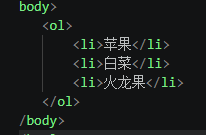
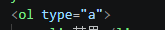
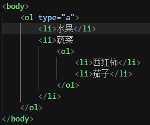
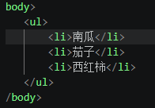
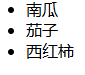
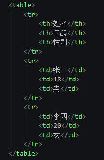
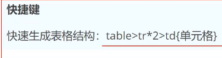
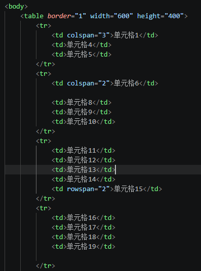
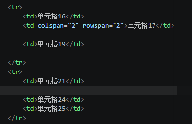

# Html学生用

## 简介

### 网页

#### 1.网页是什么

网页是网站中的一“页”，格式：HTML，它需要通过浏览器阅读

网页是构成网站的基本元素

尾缀 .htm或.html。所以俗称html文件

#### 2.html是什么

一种标记语言，不是编程语言

### 常用浏览器

火狐、谷歌、IE、Edge、Safari(苹果浏览器)...

## 开发工具Vscode

### vscode使用

- Ctrl+加号，Ctrl+减号，可以放大缩小视图
- 生成页面骨架结构：输入！按下Tab键
- 利用插件在浏览器预览：右键点击“Open In Default Browser”

## HTML标签

### 第一个HTML

- html页面中最大的标签，根标签

- head文档的头部，在head中必须设置的标签title

- title文档的标题，让网页有属于自己的网页标题

- body文档主体

  

- !DOCTYPE  文档类型声明，告诉浏览器使用哪种html版本显示网页（当前就是html5）

- lang语言种类：en为英语，zh-CN为中文

- 字符集（Character set）,通过meta标签的charset属性来规定HTML文档使用哪种字符编码，UTF-8

### HTML常用标签

#### 标题标签h1-h6

- 特点：1.加了标题的文字会变粗，字号也会依次变大

  ​            2.一个标题独占一行

#### 段落（p）

- p 标签用于定义段落

- 特点：1.文本在一个段落中可以根据浏览器窗口的大小进行自动换行

  ​            2.段落和段落之间保有空隙
  
  

#### 换行标签(br)

- br,单词 break的缩写，意为打断、换行

- 特点：1.单标签

  ​            2.只是简单开始新的一行，段落之间会插入一些垂直的间距

  

#### 水平线（hr）

- 可以设置属性：颜色color,宽度width（px是像素）,高度size,对齐方式（默认居中）align

#### 文本格式化标签

- 加粗 strong或b

- 倾斜 em 或i

- 删除线 del 或s

- 下划线 ins 或u

#### 标签之图片(img)

- src:路径
- alt:图片无法显示时候显示
- width:规定宽度
- height:高度
- title:鼠标悬停上面提示

#### 图片的路径详解

- 绝对路径
- 相对路径
- 网络路径

#### 超文本链接(a)

想跳哪里就跳哪里

跳转不一定是文字，图片...都可以

#### 文本标签

常用文本标签和段落是不同的，段落代表一段文本，而文本标签一般表示文本词汇

词汇标签可以嵌套在p标签中

#### 列表标签--有序列表

有序列表：开始于<ol>标签，里面每一项开始于<li>标签

效果

1. 苹果
2. 白菜
3. 火龙果

**type属性**

ol的type属性选项

1：1,2,3...

a：a,b,c...

A：A,B.C...

i：i,ii,iii...（小写罗马数字标号）

I：I,II,III...(大写罗马数字标号)

（尝试）

**有序列表嵌套**

#### 列表标签-无序列表

使用粗体圆点进行标记

开始于<ul>标签，里面每一项开始于<li>标签

**type属性**

ul的type属性选项

disc  默认实心圆

circle  空心圆

square   小方块

none  不显示

    <ul type =disc>
        <li>南瓜</li>
        <li>茄子</li>
        <li>西红柿</li>
    </ul>
    <ul type =circle>
        <li>南瓜</li>
        <li>茄子</li>
        <li>西红柿</li>
    </ul>
    <ul type =square>
        <li>南瓜</li>
        <li>茄子</li>
        <li>西红柿</li>
    </ul>
    <ul type =none>
        <li>南瓜</li>
        <li>茄子</li>
        <li>西红柿</li>
    </ul>

同理嵌套

常见应用场景：导航效果

快捷键：ul>li*5  回车

#### 标签之表格

表格组成：行、列、单元格

标签：表格table,行tr,单元格（列）td

表格属性：

border:设置表格的边框

width:设置表格的宽度

height:高度

#### 表格单元格合并

5*5单元格

- 水平合并：colspan（保留左，删除右）
- 垂直合并：rowspan（保留上，删除下）
- 水平垂直合并：

合并单元格6和7，合并单元格15和20，合并17、18、22、23

#### Form表单

作用：让网站具有交互性。

表单在Web网页中用来给用户填写信息，从而能采用用户信息，使网页具有交互的功能。

如登录注册、搜索框。

表单由容器和控件组成，一个表单一般应包含用户填写信息的输入框，按钮等，（输入框、按钮叫控件，表单为容器，它能容纳各种控件）

属性说明

action：服务器地址

name：表单名称

method中get\post：数据提交方式，get把提交的数据url可以看到，post看不到。get一般用于提交少量数据，post用来提交大量数据。

**表单元素**：一个完整的表单包含三个基本组成部分（表单标签、表单域、表单按钮）
