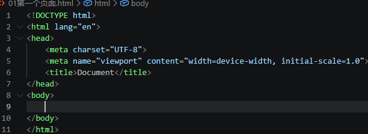
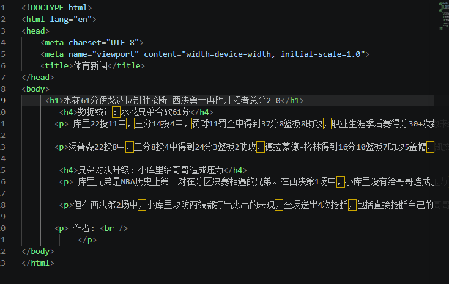
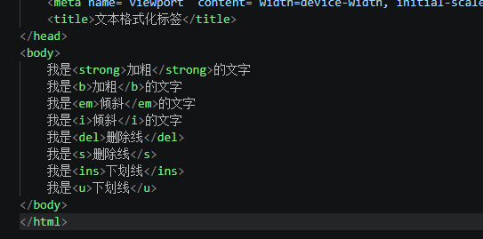

# Html学生用

## 简介

### 网页

#### 1.网页是什么

网页是网站中的一“页”，格式：HTML，它需要通过浏览器阅读

网页是构成网站的基本元素

尾缀 .htm或.html。所以俗称html文件

#### 2.html是什么

一种标记语言，不是编程语言

### 常用浏览器

火狐、谷歌、IE、Edge、Safari(苹果浏览器)...

## 开发工具Vscode

### vscode使用

- Ctrl+加号，Ctrl+减号，可以放大缩小视图
- 生成页面骨架结构：输入！按下Tab键
- 利用插件在浏览器预览：右键点击“Open In Default Browser”

## HTML标签

### 第一个HTML

- html页面中最大的标签，根标签

- head文档的头部，在head中必须设置的标签title

- title文档的标题，让网页有属于自己的网页标题

- body文档主体

  

- !DOCTYPE  文档类型声明，告诉浏览器使用哪种html版本显示网页（当前就是html5）

- lang语言种类：en为英语，zh-CN为中文

- 字符集（Character set）,通过meta标签的charset属性来规定HTML文档使用哪种字符编码，UTF-8

### HTML常用标签

#### 标题标签h1-h6

- 特点：1.加了标题的文字会变粗，字号也会依次变大

  ​            2.一个标题独占一行

#### 段落

- p 标签用于定义段落

- 特点：1.文本在一个段落中可以根据浏览器窗口的大小进行自动换行

  ​            2.段落和段落之间保有空隙

#### 换行标签

- br,单词 break的缩写，意为打断、换行

- 特点：1.单标签

  ​            2.只是简单开始新的一行，段落之间会插入一些垂直的间距

  

#### 练习：体育新闻

#### 文本格式化标签

- 加粗 strong或b

- 倾斜 em 或i

- 删除线 del 或s

- 下划线 ins 或u

