# one

学别的语言不好吗，为啥要学py?

世界上编程语言都有哪些呢?**最早的编程语言起源于机器语言和打孔卡编码**,机器语言0和1 ，汇编语言，助记符。

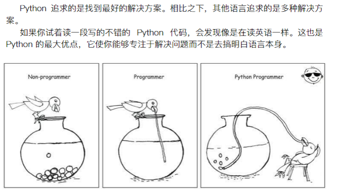

（这个图我放到网盘对应1）

先学python课程体系的第一课

## 教学标准：

1.掌握py程序基本使用

2.熟悉print命令的使用

3.熟悉数学运算符

## 单词

print 打印

## 好习惯：

建立一个专门的python文件夹，每节课创建一个文件夹。

vscode，file打开文件夹，创建第一个py文件。

## print()

最常见的功能，你把打印查看的结果对象塞进括号中，就可以了。

## 数字运算符：

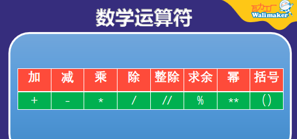

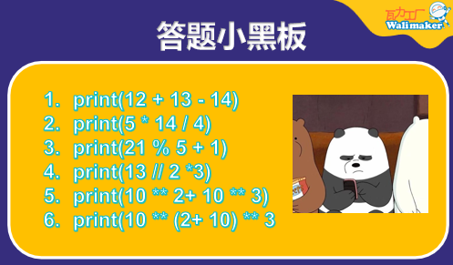

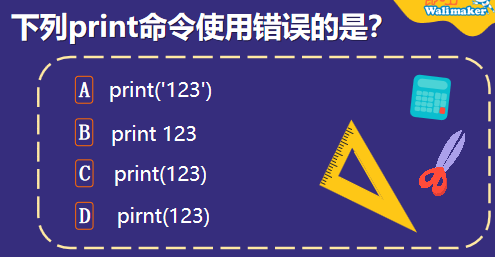

b,d

# 2

## 教学标准：

1.注释的符号和使用

2.引号和字符串的概念

3.延迟命令

## 注释

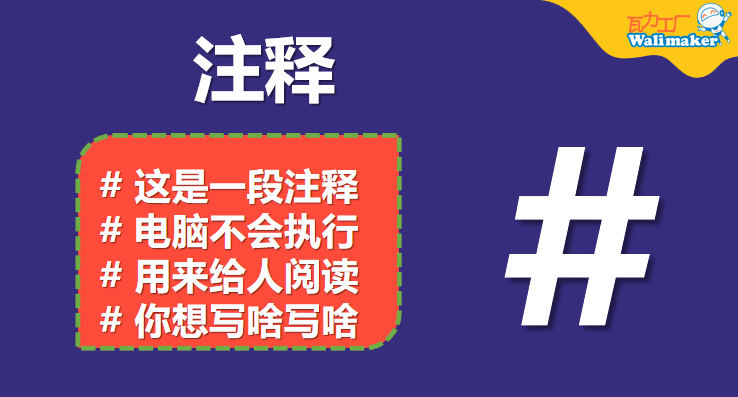

## 字符串

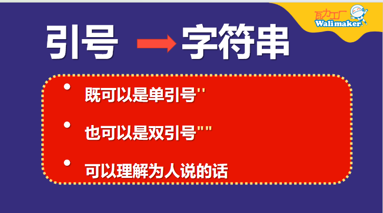

## 延时

import 导入模块（工具包）

time时间模块

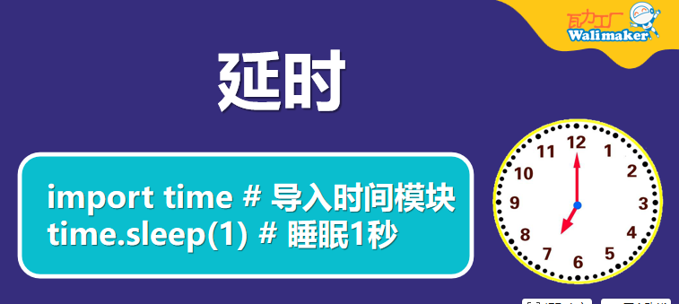

加进代码中，延时打印XXX

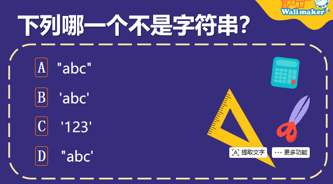

d

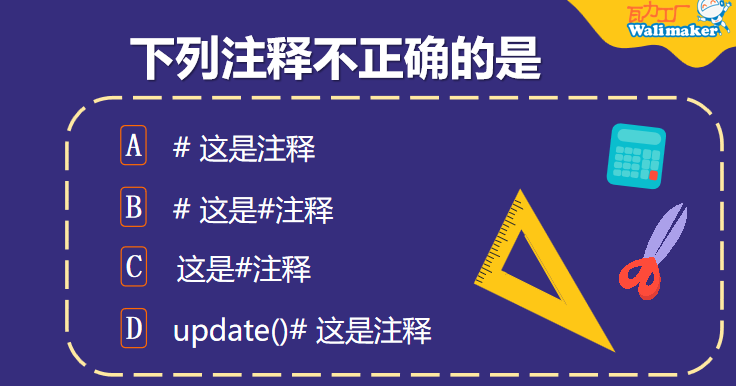

c

# 3(小和尚和老和尚)

复习：

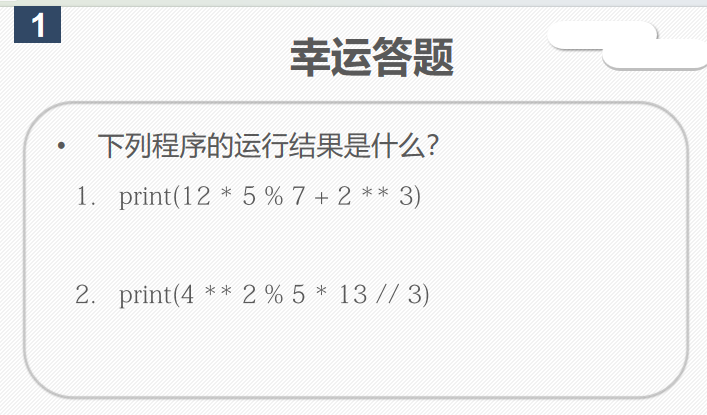

12    4

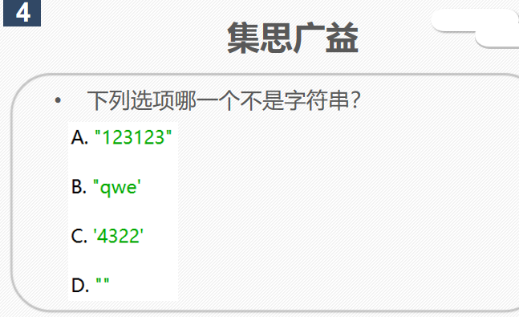

b

教学标准：

1.掌握python文件的创建和运行

2.了解顺序结构和循环结构

3.了解注释的概念

character  [ˈkærəktə(r)] 人物

while 当

True 真

say   [seɪ]  说

time 时间

sleep 睡眠

setup 设置

go to 去

注释

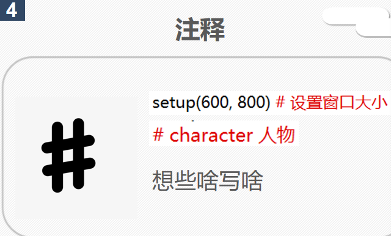

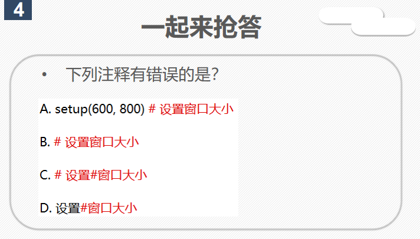

d

测试瓦力窗口

title【ai】设置窗口顶部标题栏的文字

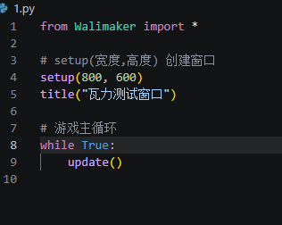

小和尚和老和尚

tracer()  /ˈtreɪsə/

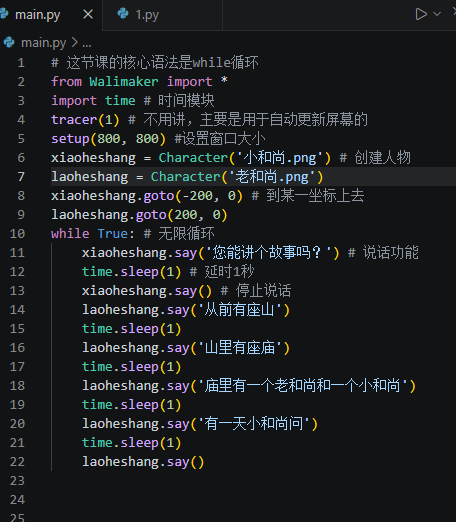