# 软测

## 01. 测试基础与AI入门(P1-P4)           

### P1. 什么是软件测试

#### 1.1什么是软件

软件是控制计算机硬件工作的工具。

#### 1.2软件基本组成

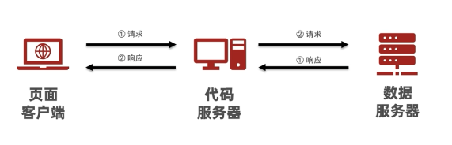

#### 1.3软件产生过程

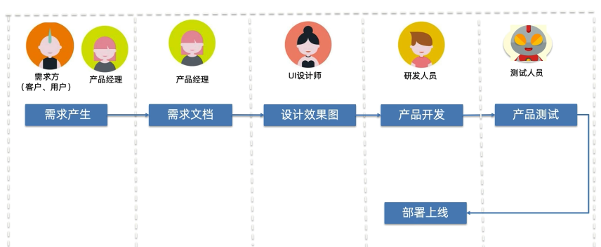

#### 1.4什么是软件测试

使用**技术**手段**验证**软件是否满足使用需求

示例：

#### 1.5软件测试目的

减少软件缺陷（bug）保障软件质量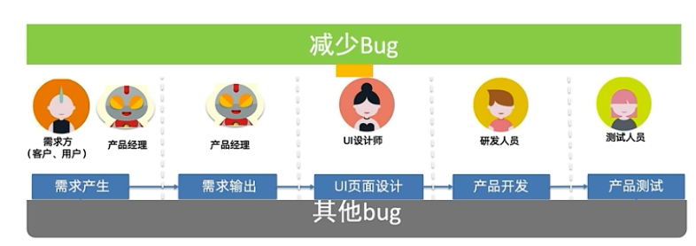

### P2. AI快速入门

初步了解AI在测试中的应用

### P3. 测试基础之测试分类

#### 1.测试主流技能

##### 1.1功能测试

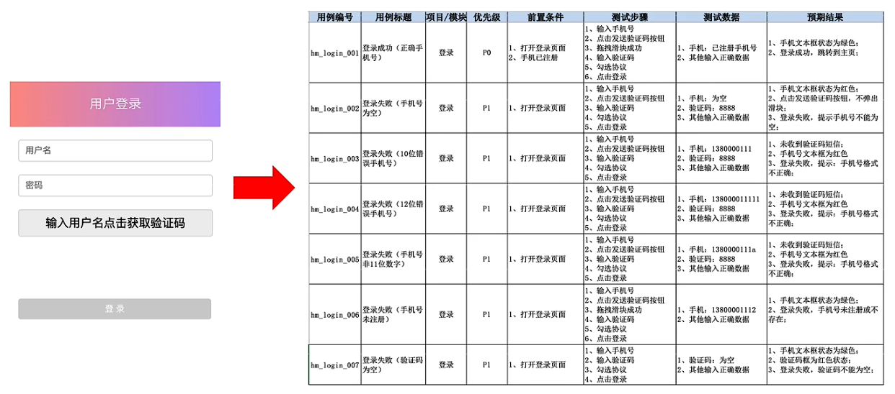

##### 1.2自动化测试

使用代码或工具代替手工，对项目进行测试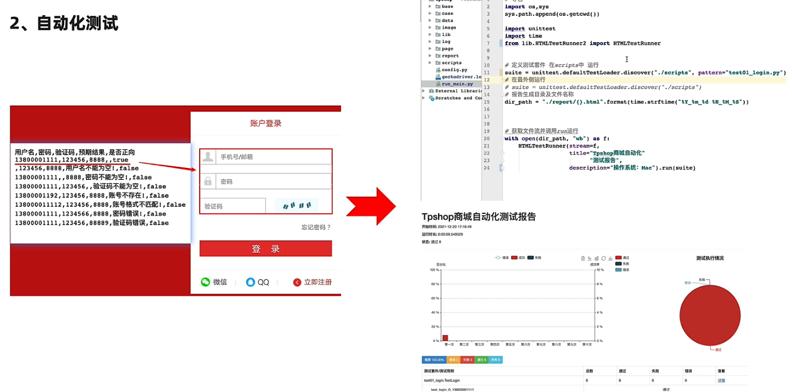

##### 1.3接口测试

什么是接口？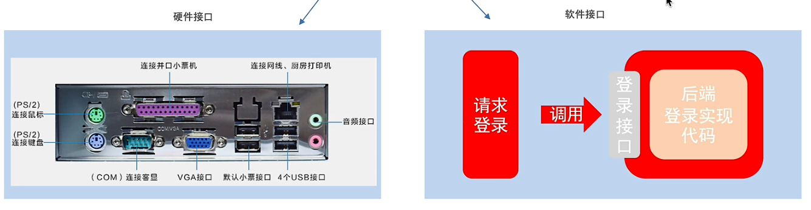
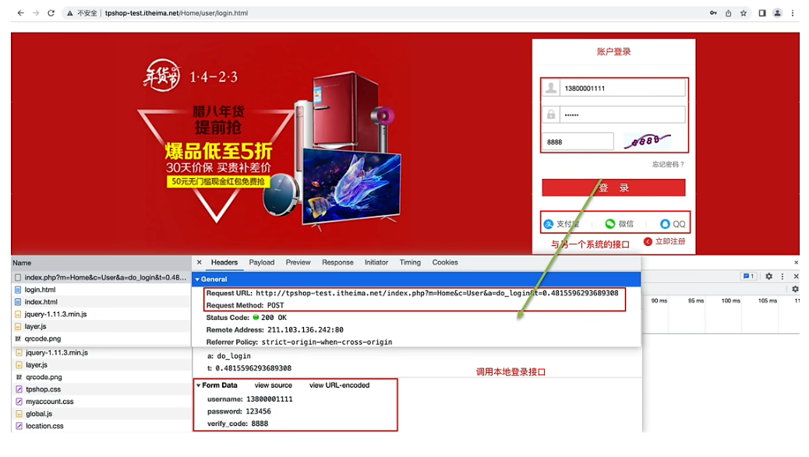使用代码或工具对服务端提供的接口进行测试

接口测试-工具实现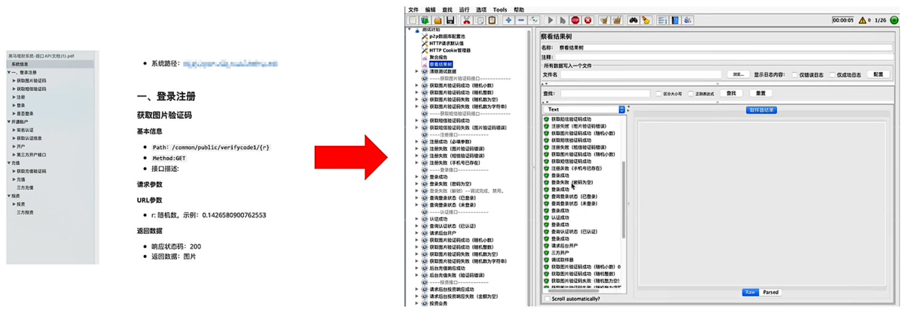

接口测试-代码实现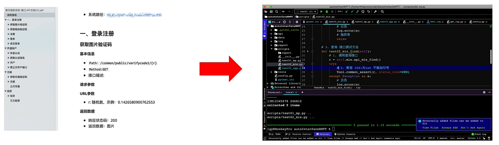

##### 1.4性能测试

模拟多人使用软件，查找服务器缺陷

性能测试-工具实现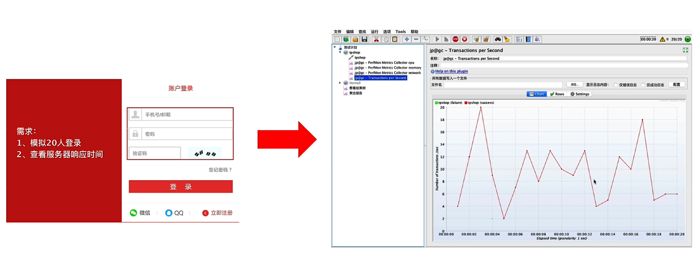

性能测试-代码实现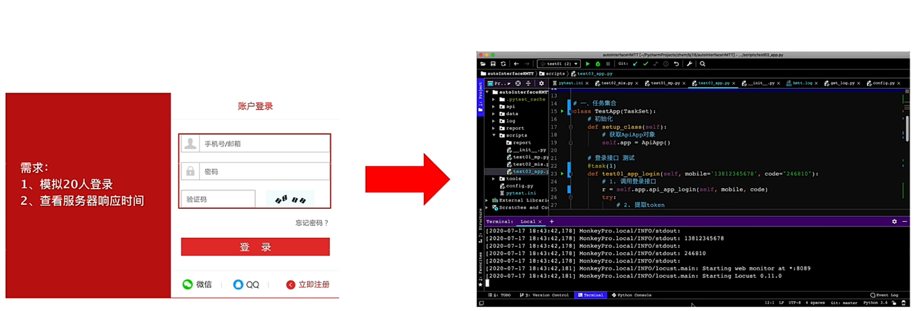

#### 2.常见的测试分类

##### 2.1测试阶段分(单元、系统、集成、验收)

**单元测试**：针对程序源代码进行测试

**系统测试**：对整个系统进行测试包括功能、兼容、文档等测试

**集成测试**：又叫做（接口测试），针对模块之间访问地址进行测试

**验收测试**：内测和公测，让不同人群来发掘项目缺陷

##### 2.2代码可见度分（黑盒、灰盒、白盒）

**黑盒测试**：源代码不可见，只能见到UI（User Interface 用户 接口）功能（对应系统测试）

**灰盒测试**：部分源代码可见，功能不可见（集成测试）

**白盒测试**：全部源代码可见，UI功能不可见（单元测试）

##### 补充(冒烟、回归)

冒烟测试：对**核心功能**的验证
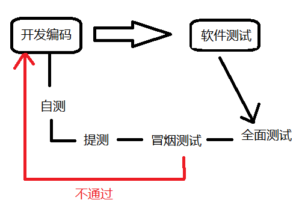

回归测试：对**已修复bug或更新后对已测内容再次测试**
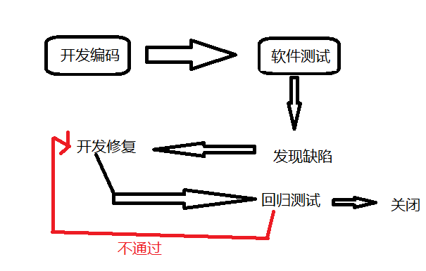
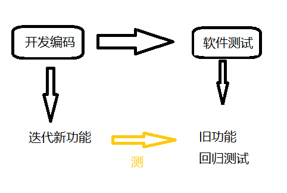

### P4. 测试基础之质量模型

质量模型： **功能、性能、兼容、易用、安全**、可转移性、可维护性、可靠性

衡量一个**优秀**软件的维度

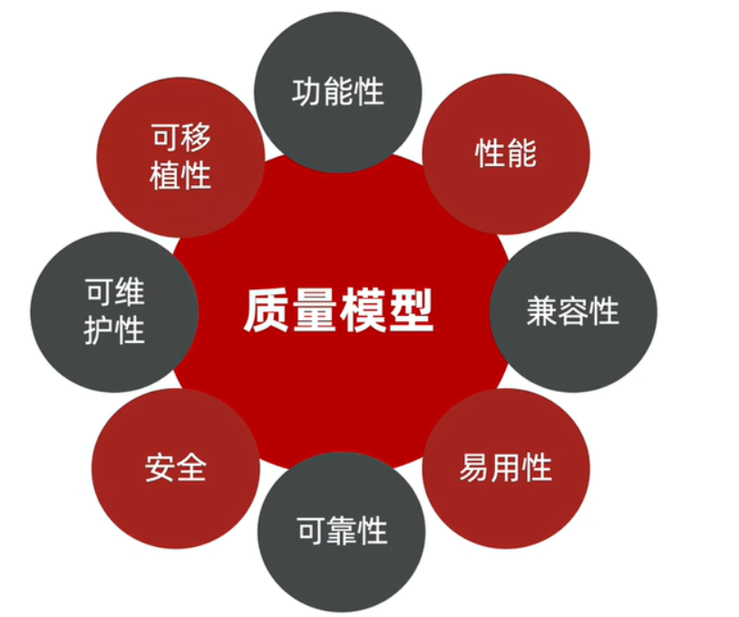

案例：需求
1.开发一款网络游戏（要求：10个主功能）
2.游戏支持web（浏览器）端、App端
3.游戏上线后预计每日，20W用户玩家在线

#### 功能性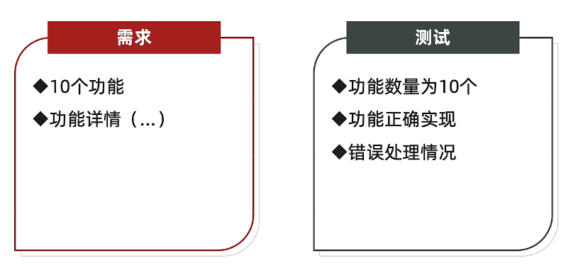

#### 性能（时间和资源）

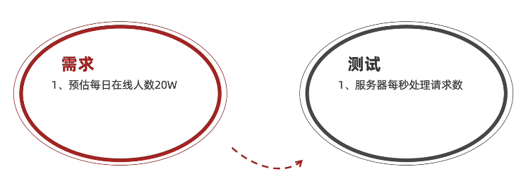

#### 兼容性（不同设备、平台上能否正常使用）

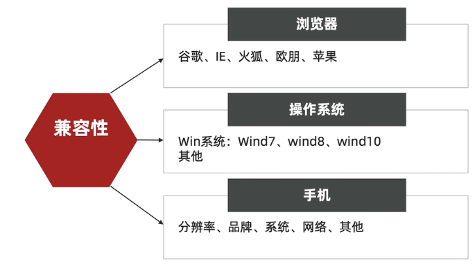

#### 易用性（易用易学用户粘度好）

简洁、流畅、美观

#### 可靠性（持久运行无异常）

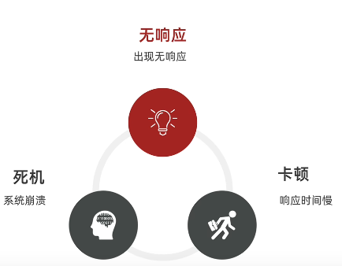

#### 安全（传输加密、存储加密）

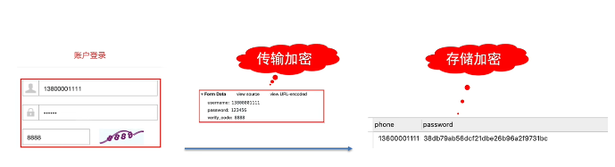

#### 可移植性（网站数据迁移）

#### 可维护性（出现异常，易修复）

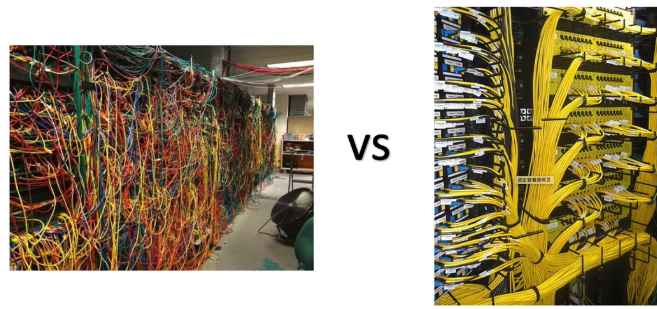

## 02. 客户端Web测试实战 (P5-P34)        

Web测试核心技能，也是你的重点。2026年4月7日

### 01 登录功能测试点分析

例子
|需求|账号：必填，已注册手机号或邮箱|
|-|-|
|分析|账号：已注册手机号、邮箱、为空、未注册手机号（移动、联通、电信）和邮箱是否要覆盖到？|
|需求|密码：必填，注册账号的密码|
|分析|密码：注册密码、为空、错误密码（写纯数字，还是纯字母）|
|需求|验证码：正确且未过期|
|分析|验证码：正确、过期、错误|

到底都要测吗？？？

#### **等价类划分法**

一种用少量数据获得较好测试效果的工具。

场景：表单类页面元素测试使用（输入框、下拉框、单选框、复选框）等。

步骤： 

1.划分有效等价类：满足需求的数据集合

2.划分无效等价类：不满足需求的数据集合

3.每类中选取代表数据

提取测试数据可以使用xmind或excel工具

### 02单功能测试点提取方法

#### **单功能**
软件程序或者应用程序只提供一项核心功能或特性，而不包含其他附加功能。比如电商系统中注册、登录、修改信息、添加购物车等等这些都是独立的功能。
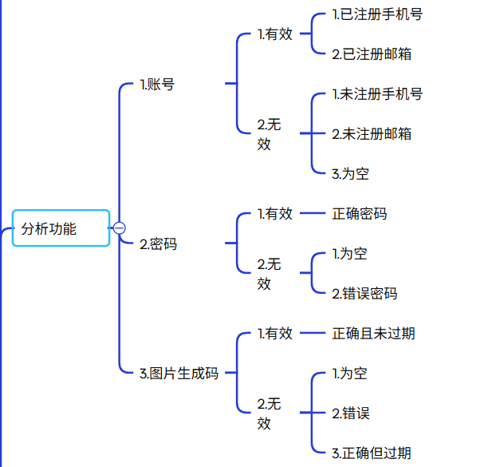
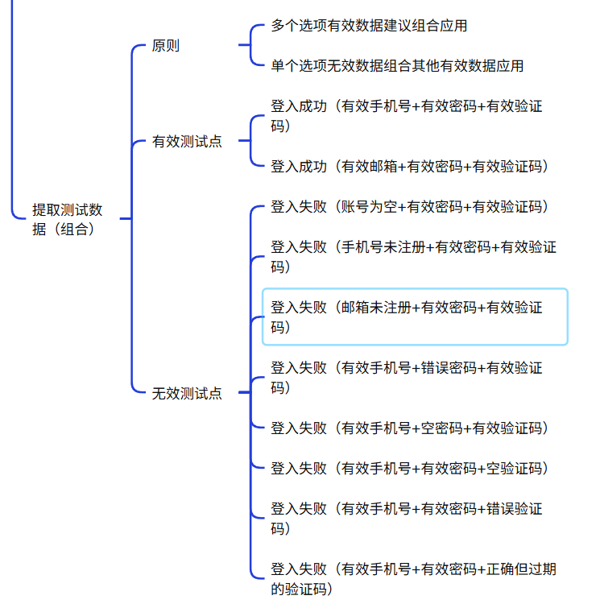

练习讲解-登录测试点分析

需求：

1.账号：注册用户名、邮箱、手机号

2.密码：注册账号时的密码

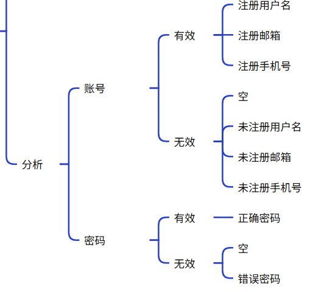
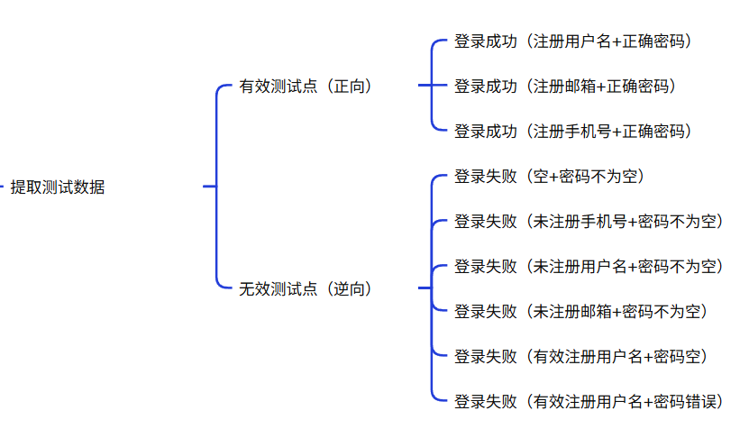

### 03长度范围测试点分析

2026年4月9日

案例：网易163邮箱注册功能测试设计

需求：

     1.账号：未注册手机号且不能为空
     2.**密码：8-16个字符，需要包含大小写字母和数字**

     3.条款：需勾选才可以注册

分析：

     1.有效：8位字符，包含大小写字母和数字

     2.无效长度：5位大小写字母和数字、18位大小写字母和数字

     3.无效规则：空、10位纯大写字母、10位纯小写、十位纯数字

#### **边界值分析法**

一个边界范围限制选取测试数据工具

- 选点

 1.上点：必测边界上点值（不考虑是否包含这个点）【8和16】

 2.离点：距离上点最近的点，选择2个（包含上点，测外的，不包含，测内）【这里就是测 
 7和17 】
 
 3.内点：必选，边界范围内的任意点（建议中间）【12】

- 步骤

  1.边界值分析（负责测试长度范围）

  2.划分等价类（负责测试类型和规则）

  3.提取数据

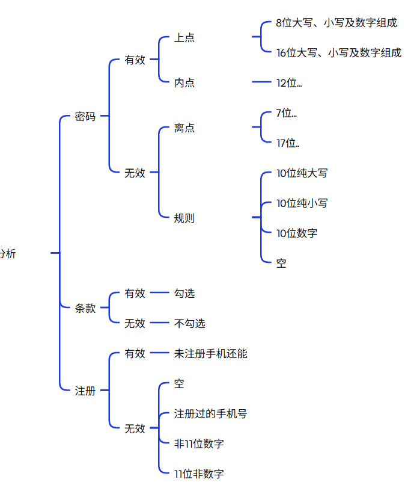
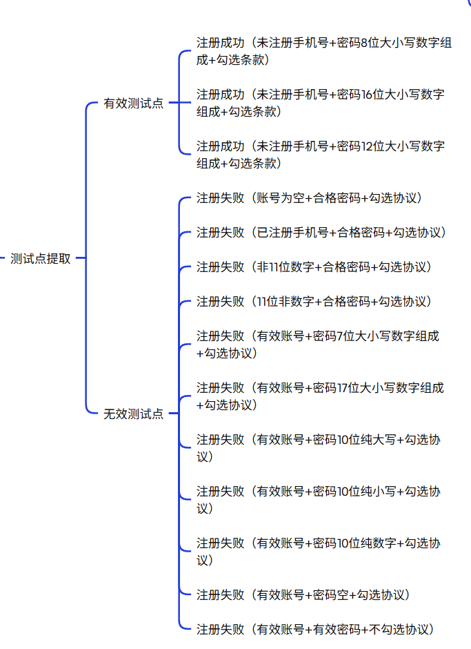

练习：（注册测试设计）需求

 1.账号：11位手机号

 2.密码：6-16位字母、数字组合

 3.图片验证码：正确验证码

 4.短信验证码：正确验证码

 5.邀请人：非必填，已注册的手机号

 6.协议：同意协议

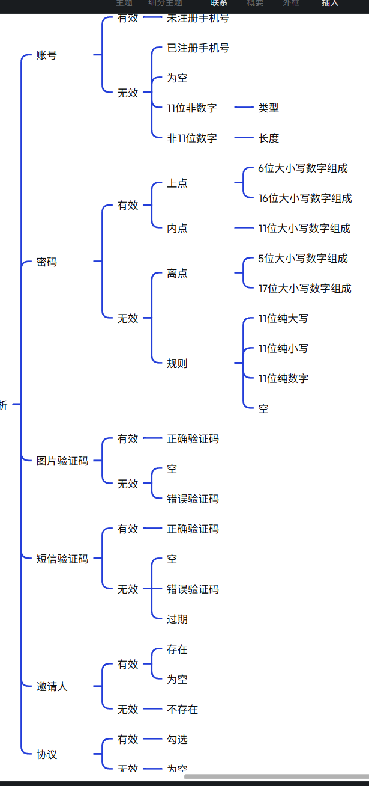
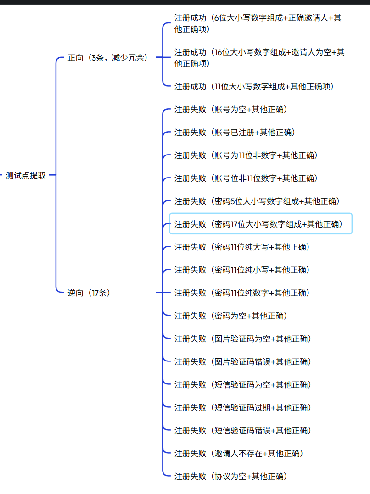

### 04非功能测试点（兼容性）

#### 非功能

除了软件功能测试，其他都是非功能测试

 1.兼容

 2.易用

 3.性能（专项）

 4.安全（专项）

#### Web浏览器

兼容：Chrome、Edge、Firefox、Safari苹果浏览器

易用：参考竞品，主观感受为主。
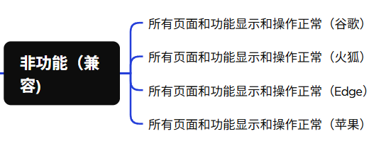

### 05测试用例编写方法

#### 测试用例

描述测试点执行的文档（测试输入、执行条件、预期结果等）

- 测试用例核心内容

用例编号、用例标题、所属模块、优先级、前置条件、测试步骤、测试数据、预期结果

 1.用例编号：项项目_模块_数字  【Hmtt_login_001】

 2.用例标题：预期执行结果（测试点）  【登录失败（密码为空）】

 3.所属模块：模块名  【登录】

 4.优先级：用例的重要程度（高P0-P3低）  【P1】

 5.前置条件：执行操作步骤的前置条件  【1.账号已注册2.已打开登陆页面】

 6.测试步骤：测试点执行的关键步骤  【1.输入账号2.输入密码3.点击登录按钮】

 7.测试数据：输入数据

 8.预期结果：预期执行结果及隐形结果  【登录失败，提示：密码不可为空，请正确输入注册账号密码】

-  练习讲解-登录测试点转用例

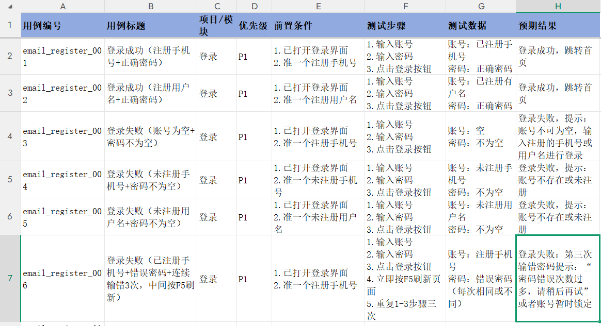
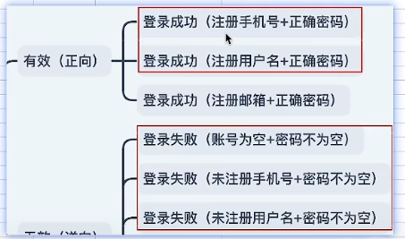

### 06判定表

#### 判定表

2026/04/10

一种以表格形式表达多条件逻辑判断的工具

- 作用：多条件之间约束规则的需求设计测试点

- 组成：
【需求：某促销活动优惠，在指定时间段内消费并且消费金额满1000元，享受9折优惠。】
   
   1.条件桩：列出问题中的所有条件（次序无所谓） 【指定时间段、满1000】
   2.动作桩：列出问题中可能采取的操作（可以有多个）  【9折、无折扣】
   3.条件项：列出条件对应的取值，所有可能情况下的真假值  【是、否】
   4.动作项：推到出条件项（各种取值情况）下应该采取的操作结果  【打九折、无折扣】

- 提示：
  
  判定表中贯穿条件项和动作项的一列就是一条规则

  假设有n个条件，全组合有2的n次方种规则

- 练习讲解-提现功能测试

需求：【提现规则验证】商家账户余额每日累计提现金额为50000元，每日累计提现次数为5次。如果超过累计提现金额或者累计提现次数，当日都无法提现。

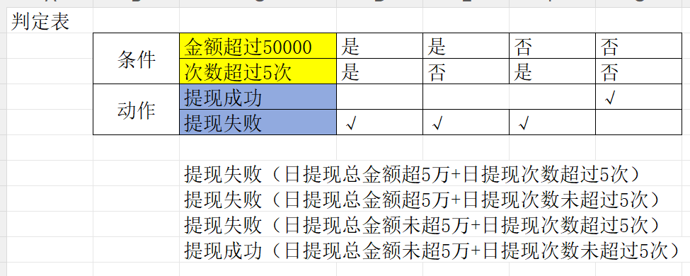
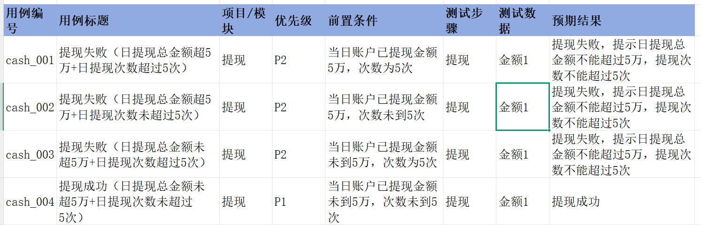

### 07 执行用例

#### 用例执行

对项目开始测试

- 前置
  
   项目提测内容开发已交付测试

   测试项目环境已经准备好

- 关注
  
   实际执行结果与预期执行结果一致，一致通过，不一致为缺陷（bug）

   项目执行隐形结果与用例预期隐形结果相似
   
   实际结果与预期结果有争议处，参考用户角度衡量

- P17. 测试用例执行.md
- P18. 缺陷描述及提交.md
- P19. 缺陷跟踪流程.md
- P20. 业务测试方法.md
- P21. 练习讲解-下单业务测试.md
- P22. 项目介绍.md
- P23. 项目-下单业务流程图绘制.md
- P24. 项目-下单业务用例设计.md
- P25. 项目-下单业务用例执行.md
- P26. 项目-下单业务缺陷提交.md
- P27. 项目单模块-登录测试点分析.md
- P28. 项目-登录测试点转用例.md
- P29. 项目单模块-购物车测试点提取.md
- P30. 项目单模块-购物车隐性测试点提取.md
- P31. 项目单模块-购物车测试点转用例.md
- P32. 项目单模块-支付测试点提取.md
- P33. 项目单模块-支付测试点转用例.md
- P34. 项目非功能测试.md

## 03. 客户端App测试实战 (P35-P46)         

App测试专项技能

### 目录结构（新增标题级别）
#### 03. 客户端App测试实战 (P35-P46)
- P35. App测试分类.md
- P36. App包发布方式及策略.md
- P37. App功能测试.md
- P38. 功能测试练习-搜索功能.md
- P39. App专项测试介绍.md
- P40. App测试环境搭建.md
- P41. App专项测试-安装、卸载、升级.md
- P42. App专项测试-兼容性.md
- P43. App专项测试-Push消息.md
- P44. App专项测试-交叉事件与体验.md
- P45. App性能测试介绍及环境.md
- P46. App性能测试-内存.md

## 04. 综合技能与进阶 (P47-P58)        

 扩大知识面，为简历加分

### 目录结构（新增标题级别）
#### 04. 综合技能与进阶 (P47-P58)
- P47. App性能测试-CPU.md
- P48. App性能测试-流量与电量.md
- P49. App性能测试实战.md
- P50. 测试总结与面试指导.md
- P51. 简历编写与投递技巧.md
- P52. Android SDK环境搭建.md
- P53. 移动端自动化环境.md
- P54. 自动化工具初识.md
- P55. 接口测试基础.md
- P56. 接口测试工具Postman使用.md
- P57. 性能测试与JMeter入门.md
- P58. AI测试提效-综合应用.md

##  面试准备

 自己总结的面试资料

### 目录结构（新增标题级别）
#### 面试准备
- 01. 测试理论基础面试题.md
- 02. 测试场景设计题-水杯、电梯等.md
- 03. 转行自我介绍与面试话术.md
- 04. 简历包装指南.md