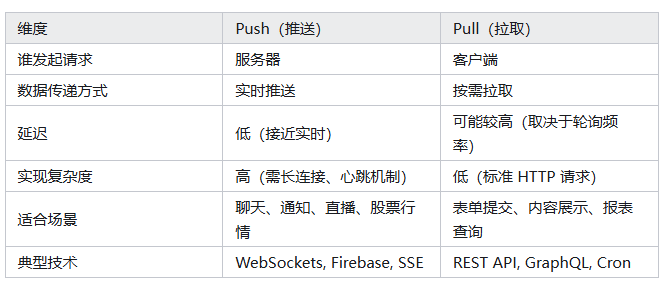
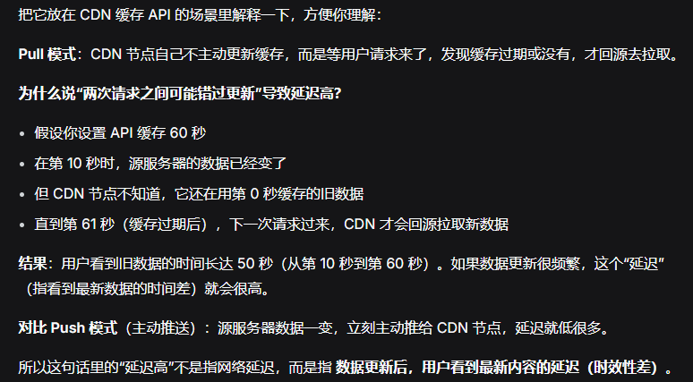
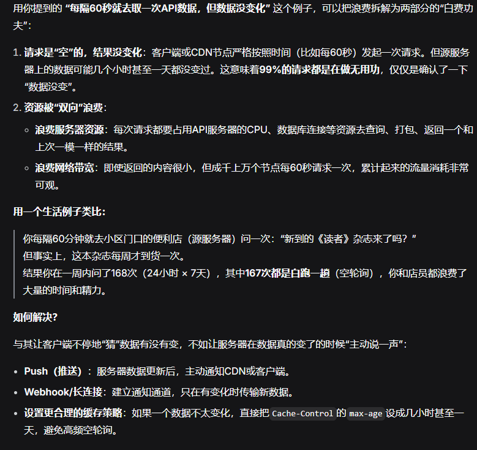
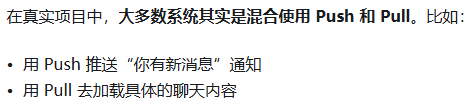
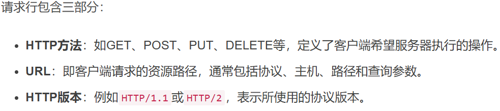
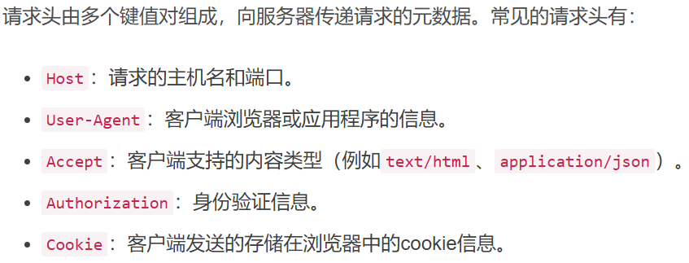
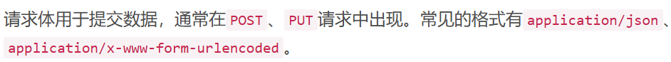
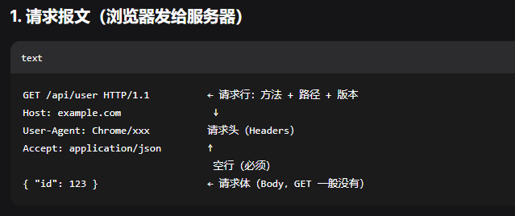
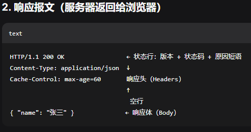
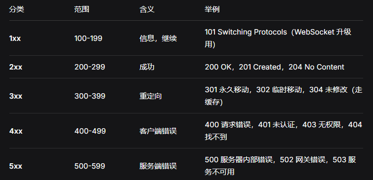

### push（推送）和pull（拉取）

数据从“服务器”传到“客户端”的两个基本模式：push和pull

**push推送**：服务器主动发起通信，只要一有新数据，它就会“推”给客户端。客户端不需要反复询问“有没有新消息”。只要连上就会有新数据时候第一时间通知你。相当于有你的快递，快递员主动把包裹送到你家门口。

优：

- 延迟低：几乎实时消息

- 用户体验好：如聊天、通知、秒到不卡顿

- 适合数据高频更新

缺：

- 实现更复杂（如要维持长时间连接）

- 客户端太多时候，服务器压力大

常见技术举例：

WebSockets（网页实时通信）

Firebase Realtime Datebase（谷歌的实时数据库）

Server-Sent Events(SSE)（服务端推送事件)

**pull拉取**：客户端主动发起请求。定期或需要时，向服务器“拉”数据，相当于你每隔一会儿去门口看看“快递到了没”。服务器被动，只有你问，才响应。

优：

- 实现简单：逻辑简单，开发成本低

- 容易缓存：如CDN缓存API响应

- 更容易扩展：多个客户端不会压垮服务器

缺：

- 延迟高：两次请求之间可能错过更新

- 浪费资源：可能频繁请求，但没新数据（空轮询）

常见技术举例：

REST API(最常见的web接口)

GraphQL（灵活的数据查询语言）

Cron Jobs（定时任务拉取数据）

### CDN

**CDN**：将 API 返回的数据临时存储在 CDN 边缘节点，后续请求直接返回缓存，无需访问源服务器。

流程：

1.首次请求：CDN → 回源 → 获取响应 → 缓存 → 返回用户

2.后续请求：CDN → 直接返回缓存

优：

- 响应更快（边缘节点就近返回）
- 减轻源服务器压力
- 节省带宽
- 抗突发流量

适用场景：读多写少、数据变化不频繁的 API（如配置、商品详情）

不适用：实时数据（股价、消息数）、个性化数据（余额、购物车）

关键控制：通过响应头 `Cache-Control: max-age=秒数` 设置缓存时长

注意事项：存在数据过期问题，需合理设置缓存时间或主动清除

### HTTP协议

HTTP是浏览器和服务器之间通信的规则。上网看网页、刷视频、调接口，底层都用它。

**客户端（浏览器）问，服务器答**，一问一答的请求-响应模式。

**无状态**-----每次请求独立，服务器不记得你是谁（需要Cookie/Token来记住）

**HTTP请求结构**：由请求行、请求头、空行和请求体组成。

请求行

请求头

请求体

**HTTP响应结构**：响应包含服务器返回数据，通常为HTML页面、JSON格式数据、图片或其他媒体文件。响应体的内容由`Content-Type`决定。

**HTTP状态码**：HTTP状态码是服务器在响应客户端请求时返回的数字代码，表示请求的处理结果。状态码分为五类。

